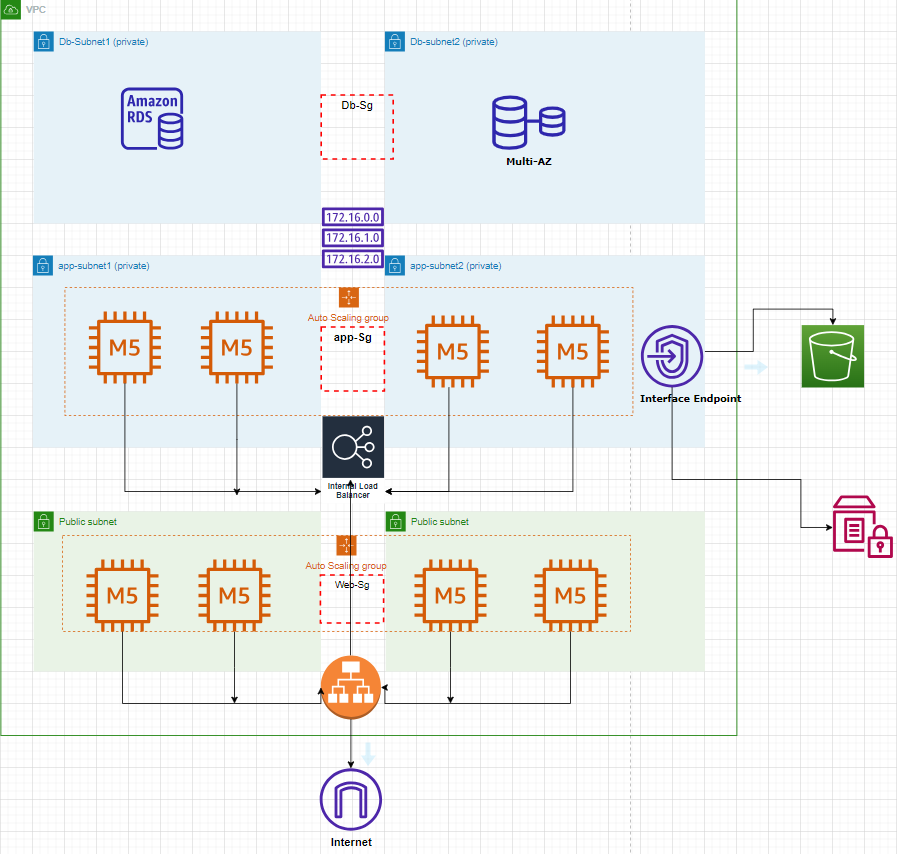

# Terraform AWS Three-Tier Architecture

This repository contains Terraform configuration files to set up a three-tier architecture on AWS using the AWS provider. The infrastructure consists of a VPC with public, private, and database subnets, along with associated resources such as Application Load Balancers, Auto Scaling Groups, and a MySQL RDS instance.

## Architecture Overview

The infrastructure includes the following components:

- VPC with public, private, and database subnets
- Application Load Balancer (ALB) for the web and app tiers
- Auto Scaling Groups (ASG) for the web and app tiers
- MySQL RDS instance for the database tier
- Security groups to control traffic between the tiers

## Prerequisites

Before getting started, make sure you have the following:

- An AWS account with appropriate permissions
- Terraform v1.0.0 or later installed
- AWS CLI v2.0.0 or later installed

## Configuration

The repository contains the following Terraform configuration files:

- `main.tf`: Contains the required providers and AWS profile configuration.
- `network.tf`: Sets up the VPC and its subnets, as well as security groups and rules for the web, app, and database tiers.
- `database.tf`: Creates a MySQL RDS instance, security group, and rules for the database tier.
- `compute.tf`: Sets up the compute resources for the web and app tiers, including launch configurations, auto scaling groups, application load balancers, target groups, and listeners.

## Usage

To use this repository, follow these steps:

1. Clone this repository:
  git clone https://github.com/yourusername/terraform-aws-three-tier-architecture.git
  cd terraform-aws-three-tier-architecture

2. Initialize the Terraform working directory:
  terraform init

3. Review the changes to be applied by running:
    terraform plan

4. Apply the changes:
  terraform apply

**Note:** Make sure to provide any required variables or input values when prompted.

To destroy the infrastructure and clean up resources, run:
  terraform destroy
